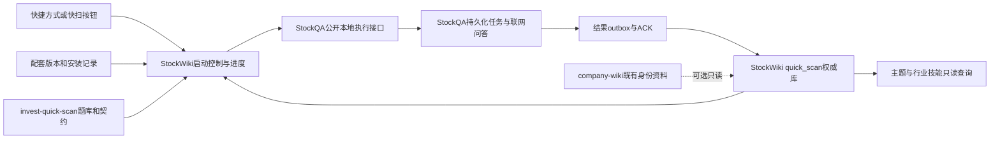

# 跨项目闭环与一键开启设计

2026-09-22，配套实施计划1.4.0。状态：待实施设计，不是已经可以运行的启动器。本文件补齐业务任务之外的安装、配置、启动、停止、升级和整体验收；入口仍为[实施包](README.md)。

## 1. 用户最终得到的操作

首次通过一个设置入口完成：项目/运行路径识别、组件版本检查、名单选择、模型顺序与预算配置、必要迁移和连通验证。以后点击“启动/继续快扫”即可开始有缺口的工作，并打开同一个进度页面。无须分别激活多个venv、启动多个终端、复制JSON、导入结果或重新配置技能路径。

日常入口由StockWiki提供：页面按钮和安装时创建的Windows快捷方式调用同一启动逻辑。下面是拟定的CLI名称，**当前尚不存在，不在本轮执行**；C07冻结后如调整名称，所有调用方和文档一起变更：

| 拟定入口 | 行为 |
|---|---|
| quick-scan-setup | 首次设置或修改设置；保存可审查配置并调用各拥有者配置接口 |
| quick-scan-doctor | 本地只读检查组件、路径、版本、schema、凭据是否存在；默认不发付费请求 |
| quick-scan-plan | 返回本次复用/补扫/待核实/冷却项与费用边界；不派发 |
| quick-scan-start | 预检后创建或复用一次运行，启动必要组件，进入扫描/接续并打开状态页 |
| quick-scan-status | 显示真实执行、导入、新鲜度、费用和能力状态 |
| quick-scan-stop | 停止新派发并排空/记录已发请求，保存剩余任务；不是删除任务 |
| quick-scan-resume | 与start共用同一恢复协议、任务键、预算账本 |

CLI归属StockWiki现有`python -m stockwiki.cli`/console entry；Windows快捷方式指向经过安装核实的绝对解释器/启动脚本，不能假设双击.ps1一定执行。后台辅助进程默认隐藏窗口，页面只在启动入口显式打开一次。不创建新的独立选股skill或第三套任务运行平台。

**一键开启的前提是首次配置完成。** 缺密钥、无名单或无预算时直接定位到相应设置项，已有画像仍可查询；不能默默使用示例密钥/默认模型/无限额度。正常启动动作会在已保存预算内发起付费问答，页面明确显示模式和额度，不每次重复要求用户输入确认口令。

结果查看是统一入口的必需功能：企业列表、分项筛选、评分依据、恢复观察、历史及事实关系详见[结果UI设计](results-ui.md)。运行进度页面不能替代企业结果页面。

首次和continuous模式的名单维护、自动/手动加公司及存储所有权见[全局契约](../system-contract.md)；维护工具与扫描工具复用同一配置，新增成员只产生增量意图。

## 2. 各组件怎样组成一个产品

StockWiki控制页面/启动生命周期，问答级领取、限流、重试、费用、检查点仍只在StockQA。快扫启动**不调用**通用scheduler-cycle、run-company、source-provider-sync或来源worker来代替快扫。通用研究任务与快扫任务应有不同类型和入口；快扫队列只能接收经过校验的快扫清单。

每个组件使用核实过的解释器与工作目录。StockWiki当前要求Python>=3.11，StockQA当前要求>=3.10；发布时核实实际依赖组合，允许各自独立venv，不把两个仓库的`src`模块拼进同一sys.path。桥接只调用公开CLI/本地协议，不直接读写对方私有SQLite或配置文件。

## 3. 配套版本、部署和技能加载

发布以一个`release_set_id`标识一组已经共同验证的组件，至少包含：

- StockWiki代码/运行接口版本和quick_scan schema版本。
- StockQA代码/执行协议版本、支持能力、费用/任务状态schema版本。
- StockQA答案schema、answer parser及证据解释release ID/hash；逐题运行receipt须记录实际加载hash。
- invest-quick-scan题库、路由、metric/rubric、交换契约和脚本版本/hash。
- 主题与行业消费技能的源版本、实际加载入口与内容hash、查询契约版本。
- 各组件依赖锁定/解释器、配置schema、升级兼容范围、通过的G0—G6回执和恢复说明。

这里的发布清单保存版本与引用，不保存密钥、公司文档或第二份可编辑名单。同样叫0.1.0但文件hash不同，不能当已验证组合。解析器/答案schema/证据解释属于真实运行组件，不能只靠V16 envelope提到能力；X07只生成候选清单并固定Q14实际release ID/hash，X08核实实际安装hash，X09逐题对照运行receipt。候选包在X09隔离测试profile中即便作为test-only active指针，也不能激活生产指针或允许真实收费POST。生产扫描要求workspace/profile当前active ReleaseSet及所有组件具备新派发资格；“源文件改了”不等于“正在使用的技能已更新”。

安装器由StockWiki提供薄编排入口，复用各项目已有安装能力；缺少的安装/自检能力补在相应项目。安装按已核实组件清单执行，不盲目git pull或全量升级用户其他项目。先核对路径与拟变更，再在授权的部署目录安装所需依赖，调用各自拥有者的迁移/注册接口。代码安装允许使用包管理器，不改变公司画像仅靠联网问答的边界。

技能安装/注册优先复用宿主既有机制；X07记录需要注册的工件，X08接线并核对实际加载位置。不能手工覆盖另一个任务正在开发的源文件或猜测`.agents/.codex`链接已生效。源目录、安装目录和运行数据目录分开记录。

两个消费技能原有的行业框架、独立研究配置和模型依赖按各自协议处理：设置页分别报告“快扫查询联动可用”和“完整深研所需资源”。缺少某行业框架不能阻止全池快扫，也不能宣称该行业深研已经就绪。G6验证实际消费入口的查库/补扫联动；不将自动完成所有深研或下载框架/公司文档加入启动动作。

首次安装可创建初始数据库和必要轻量目录；升级迁移先备份并暂停相关写入。正常点击start只检查schema是否兼容，**不自动运行破坏性迁移或自动更新整套依赖**。支持从非项目cwd、含中文/空格路径启动，不要求用户手动cd。

## 4. 配置的唯一拥有者

| 配置 | 权威拥有者 | 启动入口怎样使用 |
|---|---|---|
| 名单/成员/字段策略/默认查询 | StockWiki | 读取已保存profile和universe版本 |
| 模型顺序、凭据、能力、重试与费用预算 | StockQA | 通过其配置接口读取脱敏状态/更新指定项；不保存第二份可变副本 |
| 题库、路由、锚点与默认时效定义 | invest-quick-scan | 加载已验证版本；个性化扫描策略以引用/显式override表示 |
| 安装路径、解释器、组件版本和本机端口 | StockWiki安装记录 | 仅部署定位与握手信息，不含模型密钥 |
| 主题/行业入口的查询服务引用 | 各消费技能 | 引用同一StockWiki查询接口及其协议版本 |
| 已有证券主档/来源身份 | company-wiki或用户提供快照 | 可选只读；不可用时不触发来源下载 |

首次可导入[模型配置模板](../../examples/model-policy.template.json)，或用等价表单填写顺序、共享账户组、并发和预算；[模型策略](../../references/model-policy.md)定义五小时额度切换与逐题接续。模板不是第二份运行配置。

设置页修改模型优先级时调用StockQA公开配置接口，由StockQA自己的校验/写入器生效。配置缺失、无效和账户暂时限流分别显示；doctor仅检查本地配置状态。需要真实连通/搜索探针时，它是有预算的显式测试动作，并记入同一费用账本，不能借doctor悄悄收费。

## 5. 点击一次后发生什么

1. 定位已配置workspace、profile与active release_set指针，取得启动互斥锁；候选release_set只可dry-run预览；核对实际进程/工作区标识，不能只看PID文件或端口存在。
2. 执行本地恢复预检：确认能够安全读取账本、核对身份和处理旧outbox；与新release/新派发的兼容性分开判定。新组件不兼容不能阻断旧冻结attempt的结算，但不得创建新的generation/work、费用预留或模型请求。
3. 如果已有同工作区运行，附着其状态；否则只启动快扫需要的StockWiki页面/协调组件与StockQA worker。已有正确实例复用；不杀占用端口的无关程序。
4. 先按原冻结recipe与attempt receipt幂等导入StockQA已完成但未入库的结果并结算/ACK；再计算权威库中的有效项和缺口。每次真实POST前，StockQA先耐久写入本地`send_intent_prepared`，再调用StockWiki W16的`consume_dispatch_permit`；W16在owner事务中重新核对active指针、组件派发资格与精确attempt，并原子消费permit、写入耐久`dispatch_commit`。只有与当前work/attempt/recipe匹配的commit回执才授权一次POST。consume前资格变化或崩溃时POST为0、permit不可重放；commit后若无法证明未发送则标记`outcome_unknown`，只允许同attempt对账，不得fallback或创建新attempt。新release门关闭时只完成旧账本恢复，不能转而派发新版本题目。
5. 按冻结名单/题库/策略版本提交剩余逻辑题，StockQA在统一预算下执行。路由先于公司问题，下一阶段事实也复用同一执行器。
6. 状态页显示独立公司数、题目/证券层任务、复用、已尝试、有效、unknown、待办/冷却/失败、等待导入、实际及预留费用。HTTP页面可打开不等于扫描已启动。
7. 到达本次时长/请求/金额边界后停止新派发，保存进行中/结果不明请求；按钮变为可解释的继续/配置入口。

短时间重复点击、两个页面同时点击、再次运行CLI必须附着同一逻辑运行，不能新增一份公司任务、worker或费用额度。全部字段有效时返回“当前无需更新”，新增LLM调用为0。

预算账本在StockQA持续存在。重开页面、重启进程、更换备用模型、再次点击start不会重置已耗金额。若用户已明确配置分期补充额度，则按该策略的唯一期间键分配；默认不自动补充。时间切片结束后可以在剩余额度内继续，预算耗尽则显示具体剩余额度/所需配置，不无限创建新run来绕过总上限。

关闭浏览器只关闭视图，已经启动的worker可以继续当前有界运行；重新打开能找回状态。点击stop停止新派发并保留请求/回执；应用或电脑崩溃后，下一次start先恢复检查点和outbox，再安排新请求。仅管理本次启动或经身份握手确认属于该workspace的进程。

## 6. 状态与故障呈现

| 状态 | 含义与后续动作 |
|---|---|
| setup_required | 缺少指定配置；定位缺项，已有库仍可只读 |
| version_mismatch / migration_required | 显示不匹配组件/协议；阻止写入或派发，不伪装ready |
| ready / no_work | 本地可运行或当前无缺口；no_work不产生模型费用 |
| running / waiting_import | 正在执行或已回答待导入；分别显示对应拥有者状态 |
| retry_wait | 模型/网络暂不可用，保留待办和冷却；不无限自动轮询 |
| budget_exhausted / stopped | 明确区分金额耗尽与用户停止；旧结果和账本保留 |
| failed_component | 指明StockWiki桥接、StockQA、查询消费者等具体组件及日志/错误码；其他可用查询继续 |
| completed_with_gaps | 本轮已尝试完但仍缺证据；不宣称所有公司都有有效分数 |

若company-wiki不可用而现有身份足够，快扫照常；若某个公司身份不明只挂起它。StockQA暂不可用时可查询已有画像，不能为维持页面绿色而改用未联网LLM记忆。消费技能未正确加载时不能宣布完整研究联动就绪，但可以显示已经验收的评分能力。

## 7. 升级与回退

升级基于配套发布清单，先检查新旧协议和数据schema兼容；停止派发、排空/标记请求、保存outbox及费用预留、做一致性备份，再由拥有者执行迁移。失败时保留可用旧版本及诊断；禁止只回退一个组件造成混用旧协议。

支持回退的必须在临时副本验证；数据schema无法安全降级时，保持只读/待迁移并给出恢复路径，不能覆盖升级后的新增观察、成员或费用账本。回退不意味着把已花的钱变成未花。

## 8. 最终验收不是“按钮能打开网页”

新增M6及G6。整个计划完成要求G0—G6对应证据齐备，G6同时依赖G4完整事实/消费者和G5评分扩容交付；不得以“评分先上线”代替用户要求的整体完成。

- 从准备好的干净用户配置/部署目录，通过setup完成全部配套，无手工复制中间结果；随后从任意cwd的快捷方式一键启动。
- 使用真实组件进程和真实SQLite完成扫描、导入、查询、保存筛选、追加一家公司、停止/续扫；离线测试只在LLM网络边界用stub。
- 对重复点击、陈旧PID、端口冲突、中文/空格路径、版本不配套、worker崩溃、已答未入库、预算耗尽、全模型冷却和升级回退逐项验证。
- 通过实际加载的主题/行业技能入口查询同一数据库；验证池外发现和小范围补扫，无后台全池重问，也不触发company-wiki来源采集。
- 在有限真实预算内走同一个启动入口完成在线小样本；保留实际搜索、模型、费用、导入与消费者记录。不能以单元测试全部通过替代此验收。
- 本机安装与发行版本报告明确区分`installed / offline_ready / live_verified / full_release_verified`；有文件或有端口不算真正就绪。

本轮只建立这些契约、任务与测试规格。实际安装器、快捷方式、运行控制接口和最终在线验收由C07及X系列任务实施。
