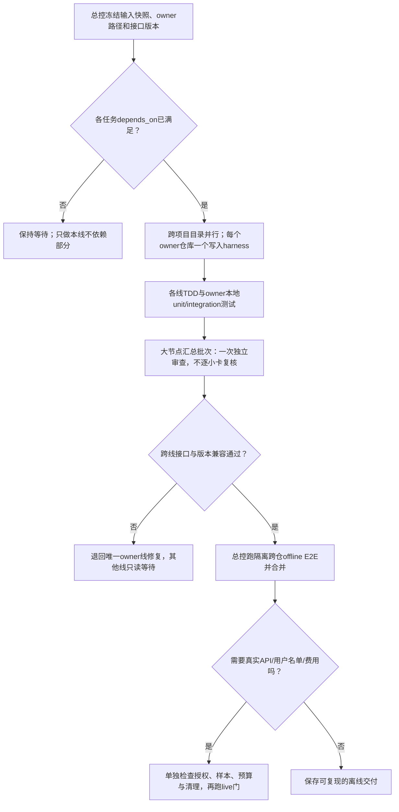

# Invest Quick Scan 跨 Harness 并行施工总控

**2026-10-07分派更新：** 当前以[本轮四个施工包](packages/2026-10-07/README.md)及其源仓/输入锁为准；StockQA与StockWiki可先做独立离线批次，Theme/Industry仍等G3/F05。两消费者的本轮唯一实现owner选各自独立Projects源仓，`local-skills`/安装镜像由总控验收后同步。下文旧local-skills归属和旧开工状态保留为历史，不覆盖这次选择。

新接手harness先按[工作恢复与交接指南](../handoff-for-new-agent.md)刷新计划和各仓快照。本文件后文所列“开工/阻塞状态”均是带日期的历史观察，不得据此假定今天的HEAD、脏树或授权仍未变化。

状态：施工包已准备；不是任务完成记录，也不自动授权写外仓或运行真实API。
版本：1.0.0；依赖任务与状态以本仓 `docs/implementation/tasks.json`、`task_plan.md`、`progress.md` 为准。

## 结论与切分原则

可以并行，但应沿项目目录和仓库owner拆，不应把同一存储、CLI、schema或测试集里互相修改的任务拆给不同harness。当前107项计划任务由五条实现线完整覆盖：IQS总控/契约与题库、StockQA执行器、StockWiki权威存储与UI、主题研究消费者、行业研究消费者。每个项目目录只归一条实现线；Theme和Industry位于同一`local-skills` Git仓库的不同技能子目录，因此必须使用不同工作树/分支并遵守子目录allowlist，之后由总控串行合并。

同一owner仓库内任务按依赖顺序由一个harness连续处理；不同时派两个agent改同一个仓库。总控本人持有IQS仓库并整合所有交付。若未来有证据证明两个模块的写入路径、接口和测试完全不相交，再修订manifest后单独批准更细切分；当前不强行拆分。

## 五条实现线

| 线 | 负责目录 | 任务数 | 工作性质 | 当前交付包 |
|---|---|---:|---|---|
| IQS总控 | `invest-quick-scan/` | 40 | 契约、题库、schema、模块路由、计划与跨线整合；由主控独占 | [lane-iqs.md](lane-iqs.md) |
| StockQA | `StockQAbyLLM/` | 26 | LLM/搜索执行、任务/预算/回执、配置、运行入口 | [lane-stockqa.md](lane-stockqa.md) |
| StockWiki | `StockWiki/` | 39 | 权威身份/名单/观察、查询、UI、启动与导入ACK | [lane-stockwiki.md](lane-stockwiki.md) |
| Theme | `local-skills/analyze-theme-value-chain/` | 1 | 只读消费快扫查询接口 | [lane-theme.md](lane-theme.md) |
| Industry | `local-skills/industry-research/` | 1 | 只读消费快扫查询接口 | [lane-industry.md](lane-industry.md) |

准确任务归属见[机器可读lane manifest](lane-manifest.json)。任务依赖仍以`tasks.json`为唯一来源，不能因为同一条线接了一个包就越过`depends_on`。

施工卡目录见[独立施工包目录](packages/README.md)：QA-04 已于 2026-10-02 收口（`fe11f63`，handoff complete、审查 approved）；SW-IDENT handoff 已 valid 但 status 仍 partial（生产证据缺口）；TH-01/IN-02 为只读预研已验收。包目录区分可做的写入候选与依赖未齐时的只读预研，不把五条长线的全部未来任务一次性宣布可开工。Q05 已由总控直接实现并 verified（`1318a2a`+`7ced082`）。

## 并行执行节奏

波次是**依赖门**，不是硬编码批次号。建议顺序：

1. **启动门**：总控核实输入分支/commit、工作树、AGENTS、task/case状态与接口release；确保harness只占一个owner路径。（历史记录：2026-09-30 首候选为 StockQA Q04；Q04 已于 2026-10-02 收口于 `fe11f63`，Q05 同日 verified，当前无自动排定的第一候选——按 `task_plan.md` 的 Next Step 与依赖重核结果选下一件工作。）
2. **可独立owner包**：满足`tasks.json`依赖的IQS、StockQA、StockWiki任务可跨仓并发；例如IQS问题/模块维护、StockQA运行语义、StockWiki身份名单，不代表这些子项当前都已到期或已授权。StockWiki W02/W03启动前先证明W01已完成，并仅写先前精确授权的8个文件。
3. **运行闭环门**：Q06–Q10、W05–W12及W15按实际依赖交接；producer schema/golden与consumer schema须来自owner真实实现。G2b需要真实StockWiki DTO/serializer golden，不能用本仓模拟正例替代。
4. **事实与消费者门**：F01–F06、V01–V15和T01/T02依赖冻结事实/关系接口、StockWiki查询能力与实际任务前置；Theme/Industry只能使用公开只读查询接口，不能直接访问StockWiki私有SQLite。
5. **放大与产品化门**：名单规模化、UI、配置、启动/安装、升级/回滚依次经过自己的依赖门。用户提供并确认首批名单；harness不得自行选定约2000家公司。
6. **全链与live门**：X09离线部署E2E先通过；X10/B01/真实搜索和费用实验仅在样本、模型、预算/套餐、联网许可、API成本与隔离方案具体确认后执行。最近一次单公司真实测试授权不等于这些批量实验的授权。

## 接口与职责边界

- **IQS**发布身份、题目模块、评分/事实口径、ScanRecipe、兼容声明与release-set契约；只提供纯契约/校验/组装逻辑，不是公司观察库，不持有模型密钥。
- **StockQA**执行问题、搜索、路由、费用预算和工作回执；只消费版本化身份/题库/recipe，不建立第二套权威公司名单/观察库，不保存财报、网页正文或公司文档。
- **StockWiki**是权威公司/证券/挂牌/名单与轻量结构化观察的写入和查询方，承担数据库、刷新、UI、启动以及导入ACK；不绕开StockQA再造LLM执行器。
- **Theme/Industry**仅消费StockWiki公开版本化只读API/CLI及能力协商结果；不直连数据库、不重复抓取或缓存正文、不复制LLM客户端、不改producer schema。
- **总控**维护跨线版本矩阵、依赖/权限裁定、跨仓测试和G0—G6阶段审查，接受各线handoff并更新planning-with-files；不把文档声明当作实现或live证据。
- **独立reviewer**只看冻结快照、diff、task/case与测试证据，read-only返回审查记录；不得顺手修同一实现。

已发布契约：身份[contract](../contracts/identity.md)、评分[contract](../contracts/scoring.md)、模型/预算[contract](../contracts/providers-and-budget.md)、交换/query[contract](../contracts/exchange-and-query.md)、题目模块[contract](../contracts/question-modules.md)、字段时效[jobs contract](../contracts/freshness-and-jobs.md)、部署/就绪[contract](../contracts/launch-and-release.md)。ScanRecipe及组件发布生命周期等新增接口仍按`tasks.json`中的V01/V16任务建设；契约文件落地并过阶段审查后再加入此目录的已发布接口清单。消费者与生产者若发现契约不足，开一个IQS变更提案并等待新release；不得私自改对方接口。

## 共享测试与审查规则

每条线按TDD做行为变更：先为目标反例写测试并证明RED，再实现最小变更达到GREEN；把相邻case组成owner定向unit/integration批次。各仓本地测试命令在lane文档中按当前仓库配置选用，禁止假设另一个仓的pytest插件、fixture或环境变量。用唯一临时目录/SQLite库/mock HTTP隔离；测试末尾确认临时根清除，且输入下载目录、公司文档、真实数据库和密钥未改变。

只有以下大节点跑完整相关回归及独立审查：G0契约基线、G1真实搜索/评分闭环、G2初始数据库/身份、G3批次/费用、G4事实/消费者、G5规模/UI/运维、G6一键启动与全链交付。身份误合并、迁移数据丢失、未知费用/并发派发、POST前围栏和真实网络/费用实验可触发额外定向审查。日常小卡不单独要求审查报告。

审查标准和handoff统一格式分别见[review-protocol.md](review-protocol.md)与[handoff.schema.json](handoff.schema.json)。worker可以在最终消息中内联JSON handoff；不需要改写IQS的中央计划文件。总控只接受路径allowlist内的改动，并重新运行依赖owner的集成门。

## 开工/阻塞状态（2026-09-30观察）

- StockQA `master`有55项未提交工作树状态。Q04执行前须冻结当前准确快照并保留Q03修复；不能从不含修复的HEAD盲目分支，也不能清理/提交其他人的更改。
- StockWiki `master`有未跟踪`.claude/`目录。原目录必须保留；分支/工作树生成前先确定其是否为工具数据，任何情况下不删除或带入产品提交。
- 2026-09-30 新核验：StockWiki `master@72531b5` 已合并 W04 G2b owner 导出，公开 `identity-export-g2b` 从 owner receipt/market registry/source bindings 形成完整 request。四个定向测试文件 64 passed（含 IQS CLI 正反例）；原 `c8cfb2e` 缺上下文的诊断已过时。参见更新的 SW-IDENT 包；W01/W02/W03 仍需逐 case 核验。
- `local-skills` Git根当前clean；Theme和Industry目标目录不重叠，可各自独立工作树，但只改自身子树，最终串行整合。
- G2b 已有 StockWiki producer 实现，待 IQS 总控按公开 CLI 和 frozen golden 独立复核并签收；S06 仍待真实 StockQA→StockWiki 事务 ACK 和真实 router 2.1 历史样本。保持相应 pending/partial。
- 当前StockQA全仓写入授权要求**每个实施批次开工前报备精确文件与目的**；StockWiki仅W01及先前批准的W02/W03精确文件范围已获授权，后续任务逐批取得用户精确授权；Theme、Industry仍只读，任何写入前须单独授权。
- 首批股票池和live benchmark样本必须由用户提供/确认。此计划没有挑选任何公司，也没有发出API请求。

## 总控完成条件

1. 任务owner映射覆盖`tasks.json`全部107项且无重复；实现线project scope不相交。
2. 每线文档含独立上下文、读/写接口、任务依赖、禁止项、测试包、review门、handoff与授权边界。
3. owner提交精确文件差异、基线与结果hash、命令及测试统计、临时根清理、live/API说明和未解问题；未达门槛的状态如实为partial/blocked。
4. 总控完成接口兼容检查和跨仓隔离E2E；G2b、S06、真实搜索/费用、首批名单等未满足项保留明确阻塞。
5. 汇总并更新planning-with-files，再按用户的提交规则只提交IQS允许文件；绝不顺带提交外仓或忽略/用户数据。
