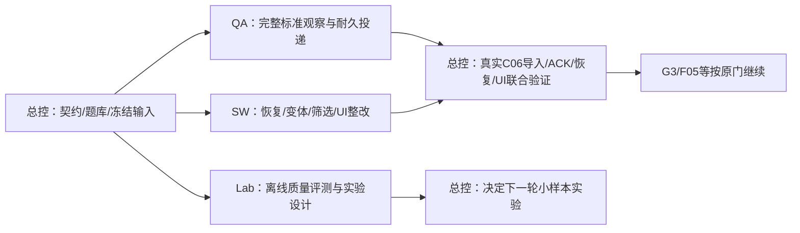

# 第二轮：三个可以独立施工的大包

总控仍唯一写入 `C:/Users/郑曾波/Projects/invest-quick-scan`。三个worker分别占用三个不重叠根目录；任何worker不得写总控仓或其他包。当前只交付施工指令，没有启动任务，也没有自动转移写入授权。

| 施工包 | 唯一工作目录 | 完成本包的实际产物 | 开工条件 |
|---|---|---|---|
| [QA-C06-02](QA-C06-02.md) | `C:/Users/郑曾波/Projects/StockQAbyLLM` | 完整标准答案、authority v2、耐久封包/版本替代/ACK接线 | 用户交给唯一QA writer；先报备精确路径，继承Phase92九件未完工作 |
| [SW-REPAIR-02](SW-REPAIR-02.md) | `C:/Users/郑曾波/Projects/StockWiki` | 六项固定反例整改，备份恢复、可比变体、旧查询和真实UI测试 | 用户授权本卡列出的StockWiki路径并确认唯一writer |
| [EVID-LAB-01](EVID-LAB-01.md) | `C:/Users/郑曾波/Projects/iqs-evidence-lab`（新建） | 离线质量评测CLI、反例集、分母/费用/缓存报告、下一轮预注册 | 用户授权新目录；目录若已出现其他内容，先核归属；本包默认零网络/付费 |

三包可同时推进各自本地交付。QA完整C06与SW恢复/UI最终汇合由总控完成；Lab评测工具可以完全离线交付，不等G3/F05。**独立表示写入、Git、DB/cache/端口和测试状态不共享；最终跨仓行为仍需联合验证。**

新目录是一次离线研究/测试工具的源仓，不是新生产服务、权威数据库或LLM客户端。Lab在原handoff中的`lane_id=iqs`表示IQS的L02分析职责；实际写入根严格是Lab，绝不授予worker写IQS。沿用[handoff schema 1.0.0](../../handoff.schema.json)，不新增工程回执系统或中央任务。

## 发给harness的完整指令

把对应卡的完整绝对路径发给harness，并明确写授权，例如：

> 按 `<施工卡完整路径>` 实施。授权只写卡中允许路径及本包交接目录；你是该工作目录的唯一writer。先读取卡、共同规范、接口及输入锁，核对动态基线。按TDD连续推进，在整个包交付时做一次集中回归/审查；不逐小步骤等复核。其他仓只读，生产库/名单/密钥/安装镜像不动，不调用收费API。返回分支、commit、交接目录和复现命令。

QA分派时再加一句：“接管总控Phase92这九件工作，复用并保留现有改动；总控暂停写StockQA。”这句话必须由人类实际发出；本README本身不代表已分派。StockWiki之前的精确授权不能自动扩大到本卡新目录；上述明确授权句用于界定本次范围。Lab新建普通源仓，不增加远端；只有用户另行要求才推送。

每个harness必须自行阅读[共同规范](handoff-rules.md)、[接口与汇合](interfaces.md)、[输入锁](inputs.lock.json)、自己的handoff模板和本卡全部内容，不依赖聊天上下文。未知路径/版本、活动writer或相关输入漂移时，只停止相应接线，提交具体差异；不能reset/clean或覆盖他人的变动。

## 2026-10-07T20:58:52Z只读起点

- StockQA `master@09f68a69bbdbf76e3a4fff63043cdd4815572e5b`：16条状态，其中9路径为总控Phase92交接，7条为旧未跟踪项，均在输入锁说明。旧文件不当临时垃圾删除。
- StockWiki `master@04dfc5190589a8bbe224a47e94b045779c884b80`：当时clean；原SW-READY-01不是全包已验收，6项固定反例待修。
- Lab：核对时目录不存在。先取得建目录权限；已存在时不假设为空。
- company-wiki `master@bfd6a4d3b83a0539c44c40111ee1c35951fcdec4`：来源采集/PWF/测试正在变动，本轮不分派。它的AGENTS将投资研究状态归StockWiki，禁止新增研究writer。
- Theme/Industry HEAD分别`3c9a49c7ce86f3e60eb9a6c8e6c835164cb8a903`/`4a80f9988f9325fb0a348c8acd9e41d615005c5f`：当时clean，但[原TH/IN包](../2026-10-07/README.md)仍等G3/F05/真实query owner golden和授权。不能用本轮文档解锁。

21:20:29Z复制交接输入前后再次核对：QA/SW状态保持相同；company-wiki已从早先45条状态增加至66条，进一步确认有活动writer。本轮输入锁记录这次新观察，QA九件和IQS四件共13份原字节快照已保存；实验索引绑定96文件全部匹配。未读取或复制其他脏文件内容。

这些是观察，不是锁。开工和交付各记录实际HEAD、分支和完整status manifest。输入锁保存SHA与总控已知修改归属，后续变动不能按旧hash强行还原。当前Windows工作树文件SHA与canonical/Git blob SHA不同口径；导出工具按对应契约核验，不能用EOL转换“修复”原输入。

## 总控回收顺序



先收各包本地交付，再集中跑真实StockQA→StockWiki正反例与双owner恢复；Lab先核工具/分母/隔离，再由总控决定是否运行另获授权的小规模live。worker不得互相修改接口或合并对方代码。没有收齐上游的联合测试填`not_run`，本包已完成部分可明确交付，不用等待另一包才能提交本地成果。

总控的形状与自述范围预检命令（不是写授权/验收）：

```powershell
python -B -X utf8 scripts/parallel_handoff_cli.py --catalog docs/implementation/parallel-lanes/packages/2026-10-07-wave2/manifest.json --package-id QA-C06-02 --input <handoff.json>
```

另外两包替换package-id。总控仍核真实commit、工件hash、日志、owner来源和环境清理。旧包/旧验收保留，只做本卡明确剩余范围。

## 本次文档交付验证

[验证汇总及原日志](validation/summary.json)：23项相关测试、三个公开CLI模板校验通过；13份快照/114项输入绑定、任务归属/写根互斥与62本地链接核验通过。没有产品实施、费用调用或门关闭。[工件索引](artifacts.json)列本包所有文件SHA，排除自身避免循环。三个template仍明确未执行、未授权；harness应填实际证据，不能把这里通过的模板当成果交回。
