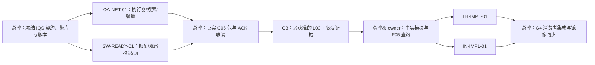

# 2026-10-07 独立施工包

**晚间接续：** QA-NET-01已做边界内整改，SW-READY-01已查收但有六项实测阻断；前两包不得从头重复实施。最新可分派剩余工作见[第二轮三个大包](../2026-10-07-wave2/README.md)。本页后两TH/IN包和原门继续有效，尚不能开工。以下开工建议保留为早间历史，不代表当前写授权。

这是新一轮分派入口，替代旧包目录中的开工判断；旧交付与预研原件保留，不重做。四个包各占一个独立 Git 仓库，总控继续独占 `invest-quick-scan` 的契约、题库、PWF 与跨仓整合。**现在推荐并行分派前两个包；后两个包等事实查询依赖齐全再开工。** 这些文件是施工指令，不是实现完成、写入许可或付费调用凭证。

| 包 | 唯一写入项目 | 内容 | 本轮开工状态 |
|---|---|---|---|
| [QA-NET-01](QA-NET-01.md) | `Projects/StockQAbyLLM` | Q10 剩余执行接线、Q13 模块增量执行、原生/外部搜索适配与恢复 | 可先做离线实施；真实调用另需预算和启动确认 |
| [SW-READY-01](SW-READY-01.md) | `Projects/StockWiki` | W12 一致性备份/恢复、U01/U02 列表与详情、真实观察查询投影 | 可先做隔离实施；不迁移或恢复生产库 |
| [TH-IMPL-01](TH-IMPL-01.md) | `Projects/analyze-theme-value-chain` | T01 主题候选与画像消费者 | 等 G3、F05、真实 query golden 和本仓写授权；不重复预研 |
| [IN-IMPL-01](IN-IMPL-01.md) | `Projects/industry-research` | T02 行业公司评估消费者 | 同上；不重复预研 |

## 分派方式

给 harness 一个施工包的**完整绝对路径**，附上“按本包开工，仅写其允许目录，按交接规范交付”的指令即可。包中引用的[共同交接规范](handoff-rules.md)、冻结输入清单、任务和契约均需阅读。前置未齐的包不能因为收到文档而开始实现；只检查是否收到新上游交付，不重新做已经接受的整份预研。

本轮采用两个技能的独立源仓作为唯一实现 owner。`local-skills`、`~/.agents/skills`、`~/.codex/skills` 和其他安装镜像均由总控在验收后安排同步，worker 不同步。这是本轮明确的分派选择，不声称历史预研已在这些源仓执行了消费者代码。

每个仓库只有一个写入 harness；总控在包交付前不修改该仓。harness 若发现同仓已有活动写入者，先只读核对归属，不能另开第二条写线。必要时使用该仓独立 worktree/`codex/` 分支，不能从不含需要的未提交改动的 HEAD 盲目开始，也不覆盖其他人的状态。

## 已核对的起点

2026-10-07 本批只读观察：

| 项目 | 分支 | HEAD | 可见工作树状态 |
|---|---|---|---|
| IQS | master | `dca3c8f06dbee5a3cab166ac73fd52467c192e85` | 既有 `?? opencode.json`，不检查内容/清理/提交 |
| StockQA | master | `6a9ff13864ebb160d5c4ab3cf2f42155d9f4aa99` | 7个既有未跟踪项，全部保留；见 inputs.lock |
| StockWiki | master | `9f552a6741dd093dc760ad6965458989cd027251` | clean |
| Theme | master | `3c9a49c7ce86f3e60eb9a6c8e6c835164cb8a903` | clean |
| Industry | main | `4a80f9988f9325fb0a348c8acd9e41d615005c5f` | clean |

以上不是锁；开工时必须重查。机器快照与关键接口 hash 在[inputs.lock.json](inputs.lock.json)，包任务/依赖在[manifest.json](manifest.json)。发现不同 HEAD/文件 hash 时判断与本包有关的变化：无关变化记录新基线，有关变化提交给总控更新契约/包；不要重跑无变化的历史验收。

当前真实限制：B01 phase-1 为 inconclusive，G3 未关闭；L03 200 家 live 未获本轮启动确认。StockWiki W09 `quick_scan_query/1.0.0` 只提供评分阶段查询原语，`facts_available=false`；`profiles_from_store` 目前只投影身份/证券，没有接入观察评分。不能将函数存在称为完整 C06 公共查询 endpoint，也不能用它解锁 T01/T02。

## 接口与汇合



独立指目录、状态、测试环境和写入 owner 互不重叠；最终联调仍有接口依赖。两条立即施工线不能修改对方协议。Q10 缺权威字段必须保持 durable block；StockWiki UI 未有事实或可比历史时显示缺口。W15、事实阶段、X01–X11 一键启动链不在前两个包中自动完成，仍按原计划推进。

## 验收和收回

日常仅跑受影响测试；每包形成一个交付批次，集中审查一次，不给每个 helper 建审查门。总控核对 commit、文件 hash、测试原始日志、owner golden 与隔离清理，再跑跨仓正反例；格式检查通过不等于验收通过。

本轮复用原 [handoff schema 1.0.0](../../handoff.schema.json)。从 IQS 根目录运行：

```powershell
python -B -X utf8 scripts/parallel_handoff_cli.py --catalog docs/implementation/parallel-lanes/packages/2026-10-07/manifest.json --package-id QA-NET-01 --input <handoff.json>
```

其他包换 package-id。旧命令不带 `--catalog` 仍按旧清单工作；旧 QA-04/SW-IDENT 不重新分派。新工具参数只选择本仓施工包目录中的清单，既不允许执行清单里的命令，也不认证写授权或自动启动任务。
