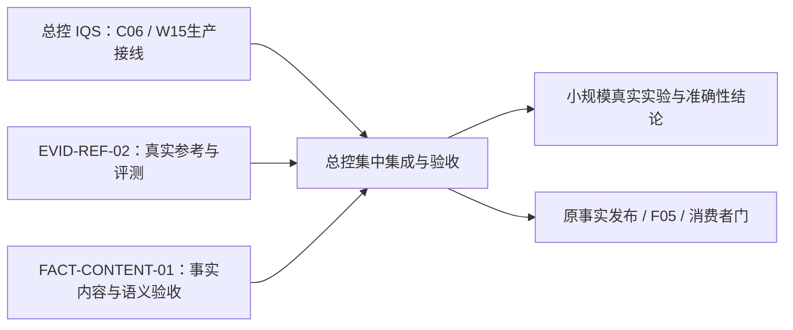

# 2026-10-10｜两个可独立实施的大施工包

本批是原 PWF 的支撑交付，不新增逐小节点审查，也不派发 agent。人类把对应完整施工卡交给一个 harness，即可认领本卡范围；开工仍须核实际目录、输入和唯一 writer。既有“全部后续所需授权”保留，不能把证据门当权限门再问一次。

| 包 | 做完得到什么 | 唯一工作目录 | 当前可做范围 |
|---|---|---|---|
| [EVID-REF-02](EVID-REF-02.md) | 三市场真实参考事实、诚实的评分依据范围、可重放逐项评测工具 | `C:/Users/郑曾波/Projects/iqs-evidence-lab` | 可实施参考集和离线评测；公开网页只读取证可做；新付费模型实验留总控 |
| [FACT-CONTENT-01](FACT-CONTENT-01.md) | 61题内容映射、术语歧义/上下游关系资料、可直接复用的语义验收包和校验 CLI | `C:/Users/郑曾波/Projects/iqs-fact-content-lab` | 可新建独立内容工具仓；全程离线；正式事实发布/查询留总控 |

两个工作目录互不包含，也不包含总控的 IQS、StockQA、StockWiki。它们互不等待、不共享可写库、缓存、端口或临时根。EVID 包不消费本次 FACT 包的未交付词表；FACT 包不消费 EVID 新参考答案。即使另一包没有开工，本包也能独立完成。

总控继续原 W15/C06 查询、执行前主体绑定和受控刷新。TH-IMPL-01 / IN-IMPL-01 仍等待 G3、F05、W11 与正式公共 owner schema/capabilities/golden；本轮没有解除这些门。当前私有 query v2 的62个合成测试不是生产接口，不进入本批输入。



## 接手只需读这些

每个 harness 从自己施工卡读起；卡中链接了全部必要规则，不依赖聊天记录。共同必读：[交接与隔离规范](handoff-rules.md)、[输入锁](inputs.lock.json)、[本批 manifest](manifest.json)、[既有 handoff schema](../../handoff.schema.json)。总控另读[编制依据](preparation.md)。

核查时 EVID Lab 为 `codex/evid-lab-01@2c0efb6370e401ca84d5f23cd5047de2bbfdec0a`；用户本轮授权的 CodeGraph 初始化已完成，仅新增两项索引配置，清单在输入锁，保留且不混入产品提交。FACT 新目录尚不存在。Git状态和日期只是观察，开工、交付分别重核，不自动还原后来变动。

## 交回哪里、怎样预检

各包在自己仓库 `docs/handoff/<package-id>/` 交付。不得把报告写进 IQS 根 PWF、旧 EVID-LAB-01 交接目录或其他包目录。

总控在 IQS 根运行现有公开预检入口：

```powershell
python -B -X utf8 scripts/parallel_handoff_cli.py --catalog docs/implementation/parallel-lanes/packages/2026-10-10/manifest.json --package-id EVID-REF-02 --input C:/Users/郑曾波/Projects/iqs-evidence-lab/docs/handoff/EVID-REF-02/handoff.json
python -B -X utf8 scripts/parallel_handoff_cli.py --catalog docs/implementation/parallel-lanes/packages/2026-10-10/manifest.json --package-id FACT-CONTENT-01 --input C:/Users/郑曾波/Projects/iqs-fact-content-lab/docs/handoff/FACT-CONTENT-01/handoff.json
```

该入口只检形状/自述范围，不鉴定金融真值、实际授权或测试通过。总控还核完整 commit、原件 SHA、日志、测试分母、参考来源和清理证明；每包一次集中接收。两个模板的 `partial/not_run` 是未执行状态，模板通过不代表包完成。

本批文档与输入核验结果见[验证记录](validation.json)，不属于产品测试或 G3/F05 验收。未新建 FACT 源仓、未替 harness 实施、未发收费 API。
