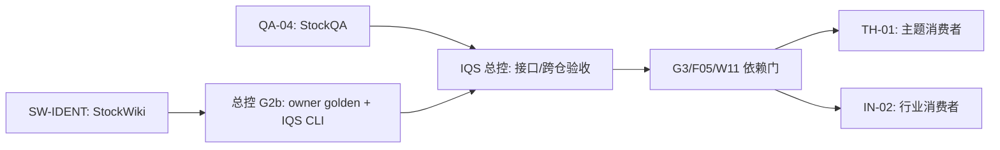

# 可分派的独立施工包（2026-09-30 基线）

这四份文档可以分别交给不同 harness。它们是**下一段施工指令**，不是已完成证明，也不扩大外仓写入、联网或费用授权。总任务/依赖以 [`tasks.json`](../../tasks.json) 为准；五条 owner 线见 [总控计划](../README.md)。交付统一使用 [handoff schema](../handoff.schema.json) 和 [大节点审查规范](../review-protocol.md)。

| 包 | 独占写入目录 | 现在可做什么 | 开工门 |
|---|---|---|---|
| [QA-04 模型策略运行语义](QA-04-stockqa-runtime-policy.md) | `StockQAbyLLM/` | 冻结含 Q03 修复的当前快照，做 Q04 的 RED/GREEN 与离线回归 | Q03/C05 已满足；先报备精确写入文件；不得覆盖该仓既有 55 项状态 |
| [SW-IDENT 身份与名单剩余验收](SW-IDENT-stockwiki-producer.md) | `StockWiki/` | W04 的 G2b owner 导出已在 `72531b5` 交付；逐 case 核验 W01/W02/W03 并只补真实缺口 | W01 必须重新确认；新 G2b/registry/receipt 文件不在旧授权内，若须改动先取得精确授权 |
| [TH-01 主题消费者](TH-01-theme-consumer.md) | `local-skills/analyze-theme-value-chain/` | 现在仅做只读接口调查/设计；依赖满足后实施 | G3、F05、W11 与公开 query API/golden 均满足，且获得该目录写授权 |
| [IN-02 行业消费者](IN-02-industry-consumer.md) | `local-skills/industry-research/` | 现在仅做只读接口调查/设计；依赖满足后实施 | 同上；与 TH-01 分开工作树、子目录白名单，串行合并共享 Git 根 |

**2026-09-30 接收状态：** QA-04 的功能反例经总控修复和独立复审通过，但共享脏树的提交/新 handoff 尚欠；SW-IDENT 在 StockWiki `8bc454e` 有部分实现和交接，W01–W03 仍 partial 且 handoff 授权路径字段需修正。TH-01/IN-02 两份只读预研已验收归档，T01/T02 实施尚未开始。逐项判定见[总控接收审查](../../reviews/IQS-lane/parallel-package-acceptance-2026-09-30.md)。StockWiki 生产查询端点仍不存在；IQS 总控负责完整 G2b 最终跨仓签收。

**2026-10-01 当前可分派性：** QA-04 的 246 项离线行为回归通过，但共享 StockQA 工作树与旧 handoff 未收口；SW-IDENT 的 113 项聚焦回归通过，但 handoff 被 IQS CLI 以 `changed_path_out_of_scope` 拒绝，W01–W03/full G2b 仍 partial。TH-01/IN-02 只读预研验收完成，T01/T02仍受G3/F05/W11和生产查询接口阻挡。不得再派第二个写入 harness 到 QA-04 或 SW-IDENT 同一仓库。

可独立重派的只读复审沿用[原始审计卡索引](../../reviews/dirty-worktree-audits/2026-10-01/README.md)：DWA-03、DWA-04、DWA-05 当前状态摘要与原快照一致；每个 harness 仍须先后核对快照。DWA-04要求和owner相同的6124项可见性；DWA-05的 `config.json` 内容必须保持未知、不得读取。DWA-06现为63项且含 `?? nul`，原62项任务快照已漂移，不能直接重用旧卡。Q05/W05暂无开工资格，分别等待QA-04收口及W01–W03/G1/S05和单独写授权。

216个挂牌候选的owner身份预览当前也不可用：只读运行StockWiki CLI帮助时没有候选导入/解析/名单预览命令；`identity-export-g2b`要求已知的精确Entity ID与`as-of`，不能消费候选清单。W02/W03须先提供隔离preview接口和逐项输出，再考虑任何名单写入。

TH-01 / IN-02 的只读预研按[预研与记录规则](../prestudy/README.md)执行。两份完整原件已从用户指定的独立技能仓库子目录接收，并按报告 SHA-256 字节归档：[`TH-01`](../prestudy/TH-01-2026-09-30-e40a079d9d69.md)、[`IN-02`](../prestudy/IN-02-2026-09-30-023f9a7960c8.md)；[索引](../prestudy/archive-index.json)固定输入提交与缺口。验收仅为 `prestudy_complete`，T01/T02 实施仍 `not_started`。原设计以 `local-skills` 为实施 Git owner，而原件留在两个独立技能仓库；实施前须明确唯一 owner、核对增量快照和写授权。

总控独占 `invest-quick-scan/`；G2b 跨仓正反例、S06 真实 ACK/历史样本、中央 planning-with-files、版本矩阵和最终集成均由总控做，不另派第二个 IQS 写入者。IQS 施工卡步骤 1–4 已完成，不重复实现；G2b 详细交接见 [现有施工卡](../../reviews/IQS-lane/G2b-handoff-2026-09-29.md)。C01–C07 旧任务回执刷新已退役并暂停。用户提供首批股票池；任何 harness 不自选 2000 家、不运行付费 live 测试。

## 分派与回收

1. 将单个包的**完整文档绝对路径**给对应 harness；每个 harness 先读文档、`tasks.json` 对应任务和目标仓库当前 `AGENTS.md`，报告 `HEAD`、工作树、接口版本、前置与确切拟写路径。已有授权不等于沙箱已放行；若执行环境拒绝越界写入，按该环境审批流程处理，不绕过。
2. 一个仓库只设一个写入 harness。StockQA 既有未提交状态不得清理/全树暂存；StockWiki `.claude/` 保留。Theme/Industry 的 Git 根相同，须独立工作树和分支，只写各自子树，合并时串行。
3. 每包先公开入口反例 RED，再最小实现 GREEN，做 owner 定向 unit/integration/隔离 E2E。大节点一次审查；高风险身份、迁移、预算并发/POST 可加聚焦审查。没有真实 producer/endpoint 时只可报告 partial/blocked。
4. worker 返回符合 handoff schema 的 JSON 或逐字段等价记录：base/result commit、变更路径/hash、契约版本/hash、测试命令/计数、临时根清理、网络/费用、review、open items。总控按确切快照验收，再更新 IQS 计划。提交只暂存本包自有文件；无法隔离既有改动时不擅自提交。

总控收到 JSON 文件后可先运行只读格式预检：`python -B -X utf8 scripts/parallel_handoff_cli.py --input <handoff.json> --package-id SW-IDENT`（从 IQS 仓根运行）。退出 0 仅表示 schema、package/lane/task 和**自述**路径/清理字段一致；它不认证用户授权、提交 SHA、测试结果或 owner golden。退出 2 的 JSON 错误不回显报告正文。正式签收仍按上条逐项核验。

## 下一批候选包（尚不可开工）

| 候选 | Owner | 计划内容 | 开工门 |
|---|---|---|---|
| Q05 | StockQA | 日志内容边界、隐私字段清除、完整模型/实体/题义/截止日请求缓存键 | Q03/Q04 已满足；QA-04 当前快照、handoff 与 review 正式收口后，按 P00 只读预检给出精确路径 |
| W05 | StockWiki | 不可变问答观察的事务导入、重放/冲突隔离和历史身份范围 | W01/W02/W03、G1、S05 已满足；StockWiki owner 给出精确路径且用户明确授权 W05 写入 |

Q05 与 W05 属于不同仓，可在各自开工门通过后并行；现在不能把它们标记为可开工卡。QA-04/SW-IDENT 有未闭合交付，不得另外派一个 harness 同时写同一仓。TH-01/IN-02 已完成的是只读预研，实施继续等待 G3/F05/W11 与生产 query/golden。

机器可读包目录见 [`manifest.json`](manifest.json)。`readiness` 是分派状态，不是 `tasks.json` 的任务验收状态；外仓如有新提交，必须重新做开工核验。
