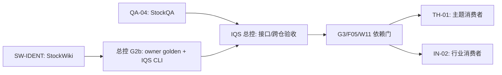

# 可分派的独立施工包（2026-09-30 基线）

这四份文档可以分别交给不同 harness。它们是**下一段施工指令**，不是已完成证明，也不扩大外仓写入、联网或费用授权。总任务/依赖以 [`tasks.json`](../../tasks.json) 为准；五条 owner 线见 [总控计划](../README.md)。交付统一使用 [handoff schema](../handoff.schema.json) 和 [大节点审查规范](../review-protocol.md)。

| 包 | 独占写入目录 | 现在可做什么 | 开工门 |
|---|---|---|---|
| [QA-04 模型策略运行语义](QA-04-stockqa-runtime-policy.md) | `StockQAbyLLM/` | 冻结含 Q03 修复的当前快照，做 Q04 的 RED/GREEN 与离线回归 | Q03/C05 已满足；先报备精确写入文件；不得覆盖该仓既有 55 项状态 |
| [SW-IDENT 身份与名单剩余验收](SW-IDENT-stockwiki-producer.md) | `StockWiki/` | W04 的 G2b owner 导出已在 `72531b5` 交付；逐 case 核验 W01/W02/W03 并只补真实缺口 | W01 必须重新确认；新 G2b/registry/receipt 文件不在旧授权内，若须改动先取得精确授权 |
| [TH-01 主题消费者](TH-01-theme-consumer.md) | `local-skills/analyze-theme-value-chain/` | 现在仅做只读接口调查/设计；依赖满足后实施 | G3、F05、W11 与公开 query API/golden 均满足，且获得该目录写授权 |
| [IN-02 行业消费者](IN-02-industry-consumer.md) | `local-skills/industry-research/` | 现在仅做只读接口调查/设计；依赖满足后实施 | 同上；与 TH-01 分开工作树、子目录白名单，串行合并共享 Git 根 |

**QA-04 已交给另一 harness 实施；SW-IDENT 尚未分派。** TH-01/IN-02 可由两个 harness 同时做只读准备，但不能把不存在的 StockWiki 生产查询端点 mock 成已验收。StockWiki 当前观察 HEAD `72531b5` 已合并 snapshot/mapping 与 W04 G2b owner CLI、registry、receipt；SW-IDENT 应先核验剩余 W01–W03，不重造这批能力。IQS 总控负责 G2b 最终跨仓签收。

TH-01 / IN-02 的只读预研按[预研与记录规则](../prestudy/README.md)执行，并用其中模板回交。两个 harness 不写 IQS；总控核对后才在本仓保存按日期/输入 hash 命名的报告，并更新 planning-with-files。当前尚无实际预研报告，不能把模板当成果。

总控独占 `invest-quick-scan/`；G2b 跨仓正反例、S06 真实 ACK/历史样本、中央 planning-with-files、版本矩阵和最终集成均由总控做，不另派第二个 IQS 写入者。IQS 施工卡步骤 1–4 已完成，不重复实现；G2b 详细交接见 [现有施工卡](../../reviews/IQS-lane/G2b-handoff-2026-09-29.md)。C01–C07 旧任务回执刷新已退役并暂停。用户提供首批股票池；任何 harness 不自选 2000 家、不运行付费 live 测试。

## 分派与回收

1. 将单个包的**完整文档绝对路径**给对应 harness；每个 harness 先读文档、`tasks.json` 对应任务和目标仓库当前 `AGENTS.md`，报告 `HEAD`、工作树、接口版本、前置与确切拟写路径。已有授权不等于沙箱已放行；若执行环境拒绝越界写入，按该环境审批流程处理，不绕过。
2. 一个仓库只设一个写入 harness。StockQA 既有未提交状态不得清理/全树暂存；StockWiki `.claude/` 保留。Theme/Industry 的 Git 根相同，须独立工作树和分支，只写各自子树，合并时串行。
3. 每包先公开入口反例 RED，再最小实现 GREEN，做 owner 定向 unit/integration/隔离 E2E。大节点一次审查；高风险身份、迁移、预算并发/POST 可加聚焦审查。没有真实 producer/endpoint 时只可报告 partial/blocked。
4. worker 返回符合 handoff schema 的 JSON 或逐字段等价记录：base/result commit、变更路径/hash、契约版本/hash、测试命令/计数、临时根清理、网络/费用、review、open items。总控按确切快照验收，再更新 IQS 计划。提交只暂存本包自有文件；无法隔离既有改动时不擅自提交。

总控收到 JSON 文件后可先运行只读格式预检：`python -B -X utf8 scripts/parallel_handoff_cli.py --input <handoff.json> --package-id SW-IDENT`（从 IQS 仓根运行）。退出 0 仅表示 schema、package/lane/task 和**自述**路径/清理字段一致；它不认证用户授权、提交 SHA、测试结果或 owner golden。退出 2 的 JSON 错误不回显报告正文。正式签收仍按上条逐项核验。

机器可读包目录见 [`manifest.json`](manifest.json)。`readiness` 是分派状态，不是 `tasks.json` 的任务验收状态；外仓如有新提交，必须重新做开工核验。
