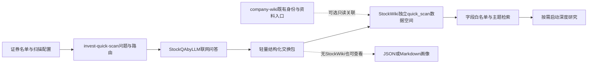

# 轻量上市公司股票池：总体设计

2026-09-22更新：评分3.0/事实61题与标准离线输出已在本skill实现；生产启动、自动/手动维护、存储和三维比较统一见[全局契约](system-contract.md)，外部接线仍按实施包执行。

日期：2026-09-19，更新于2026-09-21。状态：设计建议，尚未实施。适用范围：约2,000家独立上市公司；A/H/美股各600—800家为覆盖软目标，多地上市计同一公司，另报挂牌证券数与市场重叠。

本文基于现有项目接口核查与用户的轻资产要求。实施顺序见 [实施路线](implementation-roadmap.md)，机器可读的虚构示例见 [设计示例](design-examples.json)。本轮不采集真实公司数据，不实施数据库，不扩展第二阶段的纯信息问卷。

名单形成和维护、字段新鲜度、逐题接续、用户排序模型及主题/行业技能接入的具体设计见[股票池运维与研究联动](universe-and-operations-design.md)。该文细化本方案；拟定接口均尚待实现。

交由后续模型实施时，使用[任务与验收入口](implementation/README.md)逐卡推进；其中固定修改归属、依赖、输入/预期结果、测试证据和独立审查要求。

跨项目实现后通过StockWiki统一设置与启动，具体组件安装、实际技能加载、进程/预算接续和完整发布条件见[一键开启设计](implementation/one-click-launch.md)；最终G6要求所有必要项目及两个研究消费者完整联调。

## 1. 定位与核心判断

invest-quick-scan应成为一个“可查询、可更新、可解释的问答画像层”。它回答三个问题：这家公司是否值得继续看；符合哪种筛选条件；与某条产业链有什么实际关系。筛出的对象再进入revenue-forecast/invest-*深研。

我的建议是保留两套互相连接、独立评价的数据：

- **评分画像**：经济质量、成长机会、当前价格预期，以及每个判断的依据、反证和可用性。
- **业务事实画像**：公司/分部做什么产品，使用什么设备材料，服务哪些应用，处在怎样的商业化阶段。本地已补61道非评分问题及标准输出；生产采集与关系检索仍需F系列任务接通。

主题关联度不能提高企业质量分；企业高分也不能证明其属于某条产业链。实际筛选应是：股票池成员 ∩ 主题关系 ∩ 字段规则 ∩ 数据可用条件。

不追求一个能排列全部股票的“万能总分”。优先保留逐项分数和命中原因，分别建立高质量、成长、周期、困境反转等研究候选池。1—10分是有锚点的序数判断，不是收益率预测，也不是精密的等距测量。

## 2. 轻资产边界

画像内容只由StockQAbyLLM的联网问答填充。程序负责验证格式、计算规则和查询；不会另建财务数据采集器或公司文档知识库。

| 保存 | 不保存、不作为前置依赖 |
|---|---|
| 结构化回答、分数、简短依据、反证、业务关系 | 财报、公告、研报、新闻等公司文档副本 |
| 来源标题、URL、发布日期、所支持的字段/判断 | 网页HTML、网页正文、PDF、截图、全文搜索片段库 |
| 模型/问题/提示词版本、信息截止日、搜索执行凭据 | 向量化公司文档库、全文RAG系统 |
| 批次状态、耗用量、复核标记、历史结果 | 为每家公司建立完整深研目录和来源解析流程 |

保留的依据是短小的问答结果，不是复制原文。调试记录如需保留原始LLM回复，应限长、脱敏、设保留期，剔除提供商可能附带的网页正文；正常长期存储以结构化回答为准。没有原文归档就不承诺原文级审计或未来重新打开同一网页时内容不变。

读取已有证券身份或接收用户股票清单属于对象管理，不改变“画像只由问答提供”的原则。company-wiki资料入口可以被关联，但扫描时不自动读取、下载或复制里面的文件。

## 3. 现有能力与项目职责

| 项目 | 已核实的现状 | 建议新增/使用方式 |
|---|---|---|
| invest-quick-scan | 24道核心题、类型/行业/阶段模块、离线路由与结果校验 | 维护问题、评分锚点、指标映射、问答契约；不增加API客户端 |
| StockQAbyLLM | 已有LLM提供商、同步/异步调用、重试及有序ProviderCascade；搜索透传、分数传递存在缺口 | 唯一问答执行者；修复搜索、可空评分和结构化回答，接入用户模型顺序，再承担持久化批次恢复、故障冷却与费用记录 |
| company-wiki | 来源资料拥有者；已有经核验证券主档与身份解析；原件与来源契约有严格要求 | 可选读取既有身份映射和资料入口；不为快扫创建文档，不写入分数或产业链判断 |
| StockWiki | 研究状态拥有者；现有对象以ticker为键，已有正式证据、分类、视图与runtime jobs等机制 | 提供轻量名单工具和独立quick_scan库，负责实体桥接、成员版本、结果导入、筛选与展示；不触发正式证据资格或完整研究工作流 |
| revenue-forecast / invest-* | 深研预测、模型、来源与工件验证 | 接收候选名单、疑点和问答引用；正式研究时按自身规则重新建立可用输入 |

现有company-wiki与StockWiki的边界已明确：来源资料与研究判断分别归属。因而，**不建议把快扫结果直接写进company-wiki的公司资料目录**。复用身份和目录链接，比复用原件目录存放评分更合适。



以上批次执行器、数据库、交换包、查询接口是待开发能力。当前skill仍是单公司离线编排工具。独立问答不得以StockWiki启动成功或company-wiki存在公司目录为前提。

## 4. 对象身份：公司与证券分开

- `entity_id`：稳定的发行人/公司实体ID；业务、治理、一般竞争和经营质量通常归于该层。
- `security_id`：具体挂牌证券，包含市场、交易所、代码、股类；价格、估值、流动性和证券特有权益属于该层。
- `segment_id`：确有不同经营实质的业务分部；产业链关系必须能够定位到分部/产品，不能把集团某个小业务扩散成整个公司的主营标签。
- `universe_id + version`：本次大股票池的成员版本，记录加入、退出和原因。公司数量、证券数量、各市场数量分别统计。

A/H及ADR关系经核实后才归并；保留挂牌证券，复用同一经营画像。母公司与上市子公司即使品牌相同也不能合并。存托凭证比例、币种、股类和权益结构不能用名字猜测；证券特有权利可能同时影响治理或损失风险，并非只有估值不同。

优先导入company-wiki已有主档。其SecurityRecord目前未直接给出完整跨市场entity_id桥接；缺失时通过身份问答提出映射候选，歧义对象保留为待确认，不为了完成配额强行合并。仅在人工或足够明确的联网结果确认后启用跨证券复用。内部ID稳定，名称和代码变化只更新别名/有效期，不重命名历史数据。

StockWiki现有ticker目录保留，通过显式映射关联；不批量迁移旧目录。新增的轻量公司也不要求拥有旧式Company正式研究档案。

名单维护采用StockWiki中的确定性小工具，暂不另造独立选股skill。初建导入用户清单、既有主档或成分快照，按主要行业代表、细分补盲、变化与特殊情形分层选入；60%/25%/15%只是可调起点。人工加入默认保留标记，支持增删、恢复、跨挂牌关联、版本差异和入池理由；不先依赖全市场问答打分才能建立名单。

市场配额是运营目标，不应强行制造好公司。股票池可配置上市状态、证券类别与流动性范围；退市/移除记录保留，以免后续历史评估只剩存活者。长期成员、是否扫描和某个白名单是否通过分开管理，不能因当前亏损或低分自动移出长期池；未被扫描也不等于不合格。

## 5. 评分层：先使分数能比较、能筛选

现有24题是评分骨架。企业类型替换会计口径；行业、阶段和属性模块增加必要追问；杜邦/五力保持可选诊断。对于规模化版本，新增稳定的`metric_id`连接不同题目与白名单规则，但不是把名称近似的题目自动当作同一指标。

每条评分至少包含：对象/作用层、metric_id、question_id、题目和锚点版本、比较组、score或null、回答状态、简短理由、最强反证、来源引用、信息/财务期间、模型与运行版本、检查等级、失效时间。

| 需要分开的东西 | 处理原则 |
|---|---|
| 公司好不好 vs 回答靠不靠谱 | 质量分与证据可用性分开，不因资料少直接给企业低分 |
| 公司质量 vs 成长 vs 估值 | 分别筛选；每股成长不等于收入增长；低PE不自动意味着便宜 |
| 大类相同 vs 指标可比 | 分数附带经营类型/阶段比较组；银行资本回报与软件资本回报需分别校准 |
| 经营层 vs 挂牌层 | 复用公司画像；证券报价与价格预期单独记录，不把A股价格套到H股 |
| 未知 vs 中等 | 无资料、未联网、失败、过期、不适用分别标记；均不得假装5分 |
| 模型自述 vs 运行事实 | 搜索由提供商运行记录确认；模型自报“已搜索”不计数 |

当前v2的逐题accepted_ids审核协议不能直接用于数万题自动化。下一版本增加**screening专用可用性协议**，保持现有严格模式，不自动填accepted_ids，更不写入StockWiki的正式accepted evidence。

建议分级：

1. `unusable`：未联网、实体不明、结构失败、关键来源缺失、过期或矛盾未解。保留回答供排查，不参与白名单。
2. `screening_checked`：搜索执行、身份、时间、字段格式、来源引用完整性和内部一致性检查通过。可用于海选，但不表示已核对每份原文或事实保证正确。
3. `independently_checked`：在上述基础上，通过独立联网复问检查关键判断，或由人工打开链接抽核。记录检查方式、对象和差异；同模型重复一句话不是独立证据。
4. 正式深研资格仍由原有研究流程决定；不属于这三个状态的自动升级。

普通探索池可接受第二级；高质量白名单对财务真实性、股东权益、资金生存等关键项，以及临界高分，要求第三级。人工只集中于有希望入围、存在冲突或重大风险的少数对象，不为2,000家公司逐题人工签字。

三项关键风险已知低分时阻止默认质量白名单；关键项未知时进入待核查。困境反转策略可以另设明确规则，但不能被命名为“高质量”从而掩盖风险。具体分界沿用现有规则后经试点校准，不把任意分界当投资规律。

### 5.1 周期低谷与困境反转观察池

质量池、成长池和恢复观察池是并行入口。不得先按当前利润率、ROE、增长率或质量综合分筛掉公司，再在剩余对象中寻找反转。暂时低谷但保有优质客户、技术、成本位置或核心资产的公司，即使未达质量门槛，也应展示这些特征。

恢复观察区分：困难是否可逆、优势保留程度、催化与领先证据、资金能否覆盖恢复时限、恢复成果是否留给现有普通股。周期位置本身不加减分，正常化收益不能取历史峰值或假设立刻恢复；同时显示当期现实和恢复情景所需条件。

已在本skill 2.1中增加4道诊断及本地`recovery_watch`输出，详见[恢复观察协议](../references/recovery-watch.md)。低谷识别不要求已经明显反转，保留“有优势待催化”和“已有修复证据”；结构性损害、资金断裂和股权受损单独标风险；证据不足列为待核查。

轻量库后续导入该输出，保存标记政策版本和问题引用，卡片展示优势、原低分、反证与里程碑；不增加公司文档或估值模型。选股结果可取质量池与恢复观察池并集，也可只看其中一类；主题检索允许选择恢复观察池，不能强制套用同一高质量门槛。本地标记已实现，跨公司筛选引擎仍待实施。

## 6. 白名单规则与校准

关于优势在产业变化中能否延续、能力迁移和新旧业务净经济效果，新增[不变与变化设计建议](durability-and-change-design.md)。该文优先复用24题并提出最多三道按需桥接诊断，本轮尚未改动题库或评分逻辑。恢复观察与产业升级分开处理，机会与侵蚀风险可以同时存在。

规则是版本化配置，而不是提示LLM“选几家公司”。程序使用字段、比较符、阈值、时效和检查等级执行；逐条输出满足、不满足和无法判断的理由。

以整数分为例，`>8`仅接受9/10，`>=8`接受8/9/10。缺失、过期、N/A和口径不匹配均为unknown，不是false对应的低分。AND中有明确false则整体fail；没有false但有unknown则整体unknown；只有全部true才pass。fail与unknown均不进入该白名单，但在结果中分别保留。

规则还应固定：允许的公司类型/比较组、问题及锚点版本、最小覆盖率、关键项状态、报价有效期；不能混合旧版COMMON_与新版IQS_分数。复用行业替代题前，须建立经过校准的metric映射；无法比较时使用类型专属规则，不做跨行业榜单。

白名单结果保存`rule_version + dataset_id + evaluated_at + matched_conditions + blockers`。dataset锁定实际使用的每条观察记录，后来刷新不会改写当时的筛选理由。查询结果显示公司、挂牌证券、分部关系、各阈值分数、数据年龄和复核待办；排序优先使用策略关注的指标，综合分仅辅助。

校准先于扩容：60只证券分层抽样，覆盖三市场、主要经营类型、盈利/亏损、增长/成熟/周期/反转，并包含多挂牌映射案例。比较重点是相同经济含义能否稳定得到相近分数，不是强行令各行业分数均匀分布。

对20个样本重复运行，并对7/8/9等边界重点复问；检查分数波动、跨阈值变化、重大风险漏判、来源覆盖和缺失率。模型更换、锚点变更、合并多题调用都先在同一校准集上比较。历史评分不是未来收益承诺；后续评价筛选有效性需真实保存当时可得数据，不能用今天LLM的知识假装历史回测。

## 7. 下一阶段事实层：可检索关系，而非长篇简介

目前只确定契约和采集方向，不在本轮生成完整事实问卷。第一批信息应服务主题建池，而不是穷尽所有公司资料。

| 信息域 | 需要表达的内容 |
|---|---|
| 业务与产品 | 分部、细分产品/服务、关键技术、收入地位及适用期间 |
| 生产投入 | 使用的设备、材料、零件、工艺；与“公司生产这些东西”严格区分 |
| 下游应用 | 服务的细分应用及商业化阶段；客户行业和具名客户分别表达 |
| 供应链关系 | 有依据的具名供应商/客户关系、关系方向与有效期间 |
| 业务实质 | 研发、送样、验证、小批量、量产、终止；收入贡献已披露则记录，未披露则为空 |

结构采用`主体—关系—客体`，每条关系带业务分部、来源URL、问答记录、日期、判断依据和状态。例如`分部A—produces—液冷设备`、`分部B—uses_equipment—液冷设备`、`分部A—serves_application—AI服务器`含义不同，不能统一打一个“液冷”标签。

受控术语采用稳定ID、中文/英文名、简称和别名、上位概念；保留LLM原词。分类是多维的：一个行业码无法同时表达产品、设备、材料、工艺和终端应用。已有StockWiki分类只作对照，不覆盖其正式分类；它的keyword_heuristic回退不能自动成为已确认关系。

每条事实分别标记：`affirmed / negated / not_disclosed / unknown / disputed`；依据类型可为`company_disclosed / independent_report / industry_inferred / model_hypothesis`。这些依据类型是LLM报告的归属，检查等级另列。strict主题池只接受达到规定检查等级的直接公司关系，行业推断与模型假设单列探索结果。未查到具名客户不能猜测；“不是某客户供应商”不能因包含客户名字而被正向匹配。

量产不等于重大收入贡献；“少量布局”与主营暴露应区分。收入占比若无法从问答找到适当来源则保留unknown，禁止模型编造百分比。关系过期、业务出售或终止后，不再进入当前主题池，但保留历史。

### AI硬件检索示例

以下仅示范主题结构，不是完整行业研究或投资结论。主题可展开为计算芯片/存储、先进封装、服务器、光连接、PCB/基板、供电、散热，以及相关材料和设备等概念，再逐层细分。

流程：主题定义 → 受控概念与别名 → 对公司分部关系做有方向的匹配 → 检查商业化/实质性/时效 → 应用评分白名单 → 按公司去重、保留可交易挂牌证券。

显示结果应分成：直接产品或服务、明确的上游配套、仅使用该技术、仅推测相关。使用AI软件的公司不会因此成为AI硬件供应商；泛半导体设备公司不会因为下游可能有AI就自动被认定有可观AI收入。主题边的技术关联和公司的实际业务边都需显式展示，不以无限关系传递制造关联。

关键词负责召回，关系与状态负责筛准。初期用术语/别名表和关系表即可，必要时加全文搜索；不需要图数据库或向量数据库。FTS5的trigram全文查询对少于3个Unicode字符的词不匹配，因此“AI”“液冷”等必须走术语/别名精确匹配，不能只依靠trigram。[SQLite FTS5官方说明](https://www.sqlite.org/fts5.html)

## 8. 存储：一个轻量库，加可导出的问答快照

建议在StockWiki中增加独立数据空间，**SQLite作为结构化股票池唯一权威存储**。其表保存历史观察、关系、版本和筛选结果；JSON/JSONL用于导入、导出与移交，Markdown/CSV用于查看。这些导出不是另一个可同时编辑的权威库。

建议路径（尚未创建）：

```text
StockWiki/
  config/quick_scan/          # 规则、股票池配置、主题与术语配置
  data/quick_scan/scan.sqlite # 权威数据；不是可删除的缓存
  data/quick_scan/backups/    # 数据库一致性备份，配置版本随备份记录
  runs/quick_scan/imports/    # 有保留期的轻量交换包
  runs/quick_scan/exports/    # JSON/CSV/Markdown及深研交接包
```

这一选择依据是本机、有限writer、几千个对象的结构化查询需求，而非所有场景都应使用SQLite。SQLite同时只允许一个writer；采用短事务、统一导入入口。多台机器直接并发写共享盘文件不在当前设计内，未来真有此需求再引入服务型数据库。[SQLite官方适用场景](https://www.sqlite.org/whentouse.html)

最小逻辑表组如下，物理表拆分在实现时确定：

| 表组 | 职责 |
|---|---|
| entities / securities / entity_security_links | 公司、挂牌证券与带依据的有效期映射 |
| universes / universe_members | 以独立公司为成员的名单版本、关联证券、进出理由与manual_pin |
| runs / receipts / observations | 已导入的运行/耗用回执、逐题回答和不可变历史；执行任务与重试仍以StockQA为准 |
| score_observations / profile_classifications | 稳定指标、实际题目版本、评分与路由 |
| fact_assertions / relations | 下一阶段的事实与带方向的业务关系 |
| terms / aliases / theme_memberships | 术语、别名、主题定义的版本化投影 |
| citation_refs / observation_citations | URL、日期、简短支持说明；没有文档正文 |
| checks / overrides | 自动/独立/人工检查记录；纠错留下历史，不覆盖原始回答 |
| datasets / dataset_members / rule_results | 冻结查询使用的数据与规则结果，便于重现 |

对象表和评分长表支持按`metric_id + score + check_level + valid_until`过滤，关系表支持按`relation_type + term_id + status`查主题。先测查询计划和实际响应，再决定索引，不以2,000家公司为由引入分布式设施。

每次成功导入采用事务，重复run/item键幂等；失败的半批结果可以查询进度，但不能被标为完整合格快照。`current`是依据新鲜度与版本规则计算的视图；历史观察只追加，更正通过新记录关联旧记录。筛选数据集固定观察ID，即使不同字段更新频率不同，也能明确每项实际信息时点。

数据库由StockWiki本地命令/API写入；skill只输出交换包，不越过仓库边界写StockWiki或company-wiki内部文件。StockWiki未启用时，现有单公司交换包仍可独立查看，不把正式研究系统变成LLM执行前提。若未来改用独立数据目录，通过同一存储接口迁移；不同时维护两个主库。

不为新增2,000家公司预建原件文件夹，也不自动生成2,000套完整wiki。用户选中一家公司时，StockWiki可以从数据库即时呈现一页快扫卡片；确实发起深研后再建立对应正式研究对象。

数据库及配置需做一致性备份并演练恢复；导出包可重建局部画像，但不保证包含全部历史检查记录，所以不能把库视为缓存。数据目录默认不进入代码版本库。具体记录大小与保留期由试点测量，避免声称“永远很小”。

## 9. 与company-wiki及深研的轻量联动

**company-wiki方向**：读取可用的证券主档、已存在的entity/目录对应关系；保存外部ID和入口路径。没有条目就不关联，问答照常。网页URL不是company-wiki source_id；不得给LLM答案套原件hash、伪造EvidenceSpan或启动来源采集worker来补齐快扫。

**StockWiki方向**：快扫数据单独标为`screening`。不自动改变正式classification、accepted evidence、forecast或估值工件；轻量实体无正式研究档案也可显示。用户可从主题或白名单结果选择公司进入深研。

**深研交接**：导出公司/证券映射、信息日期、入选规则和分数、涉及的业务关系、来源URL、反证和最关键的三个缺口，以及问题/模型版本。深研读取的是研究线索，不把LLM分数当财务参数，不复用未经验证的数字构造收入预测。正式证据、财报和模型在深研自身流程中按需取得，不回流成快扫的文档依赖。

交接实现需检查实际runtime schema与validator版本。已发现现有深研文档存在不同schema版本表述，不能宣称目前已经直接兼容，也不在设计中固定一个推测版本。

**主题与行业技能**：analyze-theme-value-chain在其第5步建立公司候选时查库，第6步复用可用基础资料；仍先独立拆解完整产业链并发现池外领导者。industry-research在第6步公司评估前查询统一实体，减少对已有companies目录的依赖。两者通过StockWiki只读查询/版本化导出消费画像，只对明确缺口请求定向补扫；池外公司提名进入建议列表，不自动改长期名单。行业评分与IQS量表不直接合并，全文框架与公司文档也不回灌快扫库。具体契约和阶段边界见[联动设计](universe-and-operations-design.md)。

## 10. 批次、成本与刷新

按每家24题估算，2,000家独立公司对应48,000个逻辑答案；若平均31题则为62,000个答案。实际须按类型替代、诊断/补充、路由、证券层题与复核计算，不重复给同一公司多地挂牌回答经营问题。逻辑问题数量不等于未来的API调用数量，预算必须按实际路由清单计算。

在StockQA中支持每次4—8道相关问题的结构化question pack，每题仍返回独立ID、分数、依据和状态；禁止把几个独立经济判断只给一个总分。先逐题取得基线，再验证pack是否稀释来源、漏题或造成评分互相影响。通过后才能用于省调用；失败则保留逐题执行。

费用预估公式：计划请求数 × 试点观测的平均输入/输出token费用与搜索费用 + 有上限的复核/重试预留。记录实际耗用、失败调用成本与价格版本；没有选定提供商和实测前，不给虚构的每公司成本或完成时间。

职责只保留一套：StockQA负责并发、搜索、重试、缓存、断点与费用；skill负责计划哪些问题；StockWiki负责导入和查结果。利用现有异步提供商，不在skill复制队列、HTTP、密钥或退避逻辑。若存在现成批次状态机制先扩展，缺失能力才补在StockQA。

逻辑待办按对象作用层、问题语义/锚点版本、实质路由和刷新代次去重；新run_id、今天的汇总日期、备用模型或白名单阈值变更不会自动重问全部题。逐次请求另留提供商/模型、提示词、调用方式与截止日；完整请求缓存仍需区分这些参数。只补缺失、失败或确实失效的题，原观察及日期保持不变。

执行进度在StockQA持久化，StockWiki只导入结果与回执；入库失败只重试导入。外部请求结果不明时显式标记并保留费用预留，不承诺提供商不支持幂等时绝无重复收费。只允许一层API重试预算；达到费用上限即停止派发、保存待办。按用户配置顺序选择首个可用且支持搜索的模型，服务故障才有限切换，不因低分或unknown而自动换模型。

刷新建议是初始运营参数，试点后调整，不在本轮创建自动化：

| 字段/对象 | 初始刷新策略 |
|---|---|
| 业务结构、设备材料和应用关系 | 半年复查；已知业务出售/转型时定向复问 |
| 财务质量、资金生存、每股成长 | 新财报发布后刷新相关题；全池可按季度分批复问 |
| 治理、关键风险、明显矛盾 | 入围前复核；已知重大事件后定向刷新，不声称无新闻流也能实时发现全部事件 |
| 估值与报价 | 进入价格型白名单或用户查看时刷新，严格显示报价时点；不每天为全部公司重跑业务题 |
| 活跃候选、观察池、低优先级对象 | 分层分配复问预算，保留最后扫描时间和stale状态 |

新鲜度逐字段判定，初始上限为稳定业务180天、财务90天、关键风险30天、活跃恢复14—30天，报价按需更新；已知新信息可提前使相关项失效。导入/检查时间不替代实际信息日期；unknown冷却只是延后重问，不能计为有效覆盖。全池任务必须保留首次覆盖和最旧对象的调度份额，不让热点公司无限挤占普通公司。详细规则见[新鲜度与接续方案](universe-and-operations-design.md)。

只靠LLM搜索可能得不到指定时点的可靠报价；此时估值项unknown，仍可按非价格质量条件筛选。若以后需要精确实时行情，应另开需求，不在本轮悄悄引入新数据采集渠道。

## 11. 最小成功标准

首个可用版本不是“回答了2,000家公司”，而是：小样本真实联网成功；关键项不被默认分数污染；白名单规则可重现；对象不会串公司；失败可以续跑；没有任何公司文档被下载或归档。

评分闭环稳定后，再以真实问题验证产业链检索：能找到“为AI服务器生产液冷设备”的公司，区分“自己使用液冷”和“仅宣布研发”，显示关系、分部、依据及商业化状态。最后才扩展至完整股票池。

实施阶段、验收指标和待配置偏好见 [实施路线](implementation-roadmap.md)。本轮产物只是设计，已有代码能力与新增建议不能混同。
