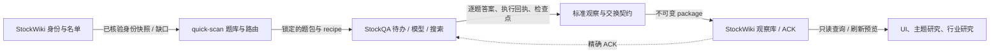

# 全局运行、存储与比较契约

2026-09-22。与实施包1.4.0配套；本skill题库/离线契约已实现，以下StockWiki/StockQA生产接线仍待实施。此文统一解决入口、名单演进、数据权威和公司×时间×模型比较；细节分别见[启动设计](implementation/one-click-launch.md)、[结果UI](implementation/results-ui.md)和[输出协议](../references/standard-output.md)。若旧文档仅写“提名后手动加入”，以本文的可配置自动准入补充为准。

## 1. 首次启动与日常维护只有一套工具

产品入口归StockWiki，复用其现有Web UI及`python -m stockwiki.cli`。未来`quick-scan-setup`一次登记各组件路径、工作区数据目录、种子名单、扫描范围、模型策略引用、预算和维护策略；随后`quick-scan-start`或同一快捷方式打开企业列表及运行状态。没有配置时进入设置页面，有配置但执行器不可用时仍可查看已有数据。这些新增命令当前尚未实现。

首次流程：本地doctor → 主档/种子导入与身份核实 → 去重与分层名单预览/应用 → 有预算的连通探针 → 小批评分 → 评分可信后事实采集 → 查询/比较。建池和扫描分开计数；名单已建2,000家不等于已付费扫描2,000家。开发者的实施包校验工具不是用户日常启动器。

| 动作 | 用户入口与唯一执行方 | 结果 |
|---|---|---|
| 手动新增1家公司 | StockWiki“加公司”/universe.add | 名称或交易所+代码解析，唯一身份直接加入并manual_pin；歧义只挂起该对象 |
| 批量导入 | universe.import/preview/apply | CSV/JSON版本化导入，给出新增/已有/歧义/跨挂牌关系 |
| 发现候选 | universe.discover/nominate | 主档新增上市、覆盖缺口、研究技能提名；只形成候选与来源，不直接信任LLM身份 |
| 自动准入 | universe.evaluate/apply-auto | 根据已保存策略核实身份和范围，原子新增成员及增量扫描意图 |
| 管理变化 | universe.pin/unpin/remove/restore/diff/explain | 逻辑状态和完整记录；不删除旧回答，不按低分快速清退 |
| 后续扫描 | quick-scan-start/resume | StockWiki算缺口，StockQA接续逐题待办；新成员不重启整池 |

自动准入是明确可用的模式，不局限于“给用户列建议”。首次设置选择`propose_only`或`auto_admit_verified`；后一模式在已配置市场/证券类型、身份验证、行业覆盖及新增名额内自动加入。默认值只是设置建议，例如每月复核主档、每维护周期最多20家自动新增、约2,000家为软目标且自动扩容有上限；这些数值由用户保存后生效。手动加入可明确突破自动名额，不挤走旧成员。

自动准入条件：确为适用的上市企业、主档可确认有效挂牌、无身份/母子/重组歧义、不是ETF等排除类型、未被用户逻辑移出/列入禁止自动恢复、未超过当期配额。相同候选的多个提名合并成同一事件；并发准入按entity与策略期间键防重。自动队列不覆盖manual_pin；被手工移除的公司不能下一轮又静默加回。模糊名、私营供应商、传闻IPO只留候选，不付费扫描。单一挂牌退出但另有有效挂牌时保持公司活跃。

持续模式与单次模式使用同一执行器。`start --mode continuous`是拟议的可选本地常驻运行：StockWiki持有维护时钟/准入记录和协调生命周期，StockQA持有问答任务、模型冷却和预算。每轮依次重投待导入结果、处理到期维护/成员增量、算字段缺口、派发预算内任务，然后等待下次有工作；不空转搜索。关机期间不运行，下次启动按持久化到期键接续，错过的维护周期合并处理，不积累无限追赶任务。系统服务/开机启动是安装选项，不在本轮创建计划任务。

账户预算耗尽时保留扫描意图；允许已配置范围内的本地成员更新，但不能假装新公司已扫描。若发现候选需要LLM，其提名请求也走StockQA并消耗同一个预算；读取现有主档快照不消耗LLM。跨日/重启不补额度，除非用户预先配置了明确期间额度策略。

## 2. 三个项目合作，但每类状态只有一个写入者

| 数据 | 权威拥有者 | 其他项目如何使用 |
|---|---|---|
| 题面、语义/锚点、路由、标准schema | invest-quick-scan | 只读已验证版本和hash |
| 实体/证券桥接、候选、成员、人工pin/排除、维护策略 | StockWiki quick_scan | 来源主档只读引入；分配本地稳定ID，不回写company-wiki |
| 逐题任务、执行时间、实际模型、搜索回执、费用账本、结果outbox | StockQA | 公开接口/不可变交换包；不让UI另记可写预算 |
| 验收后的不可变观察、事实关系、扫描快照、规则/视图、查询投影 | StockWiki quick_scan | UI及研究技能查询同一库；接受程度与结构有效性分开 |
| 财报等文档、source_manifest/EvidenceSpan | company-wiki | 可选身份/已有来源关联；快扫不写文档、不伪造正式来源工件 |

### 身份解析补充：发行人、证券、挂牌分层

`entity_id`代表法律发行人，由StockWiki随机生成并永久稳定；它不等同于快扫经营分析的报告范围。每个快扫分析范围由独立的`analysis_subject_id + analysis_subject_revision`标识，并显式记录主发行人、报告范围类型和有来源/有效期的成员关系；集团控制关系不自动代表并表。公司名、简称、品牌和ticker只是带来源/辖区/语言/有效时间的非唯一声明。外部编号按scheme、签发机构、辖区和作用层命名空间化；CNINFO `orgId`、Dayu ticker-derived ID等仅是来源内crosswalk。证券类别使用独立`security_id`，交易场所代码使用独立`listing_id`；精确挂牌键至少包括venue/MIC、本地代码和有效时间。模糊名称或LLM建议只可生成候选，`unresolved/conflicted`对象不进入付费扫描；只有可追溯的权威发行人映射或经审计的手工决定才能连接跨市场挂牌。名称更改、ticker改码、报告范围变化、合并/拆分通过追加事件与revision表达，旧观察的subject、issuer、security、listing、时间、模型和分数不可改写。

并表范围不能靠成员issuer已登记、集团控制关系或membership上的URL字符串证明；新Work须取得owner核验、精确绑定`analysis_subject_id@revision`及完整范围摘要的trusted reporting-perimeter receipt。身份和主体事件要匹配前后快照，受影响ID集合精确对应实际变化。市场代码由owner控制的ISO辖区/MIC注册表校验，MIC必须属于声明辖区；缺目录或目录不确认时失败关闭。LLM联网检索可提供候选披露证据，但不能自行创建可信映射、并表回执或身份归并。

代码目录与数据目录分离。setup选择一个工作区data_root，下面分别由StockWiki和StockQA管理独立运行子目录/SQLite；用户可用统一工作区备份入口，但不能共享可写SQLite。示例布局为`data_root/{workspace_id}/stockwiki/`与`.../stockqa/`，最终按各仓现有路径约定冻结。Git仓库存schema、题库、虚构fixture，不存2,000家公司运行库、密钥和outbox。company-wiki的公司目录不是成员名单，也不是快扫主存储。

数据流程：问答成功→StockQA持久化内容/执行回执→outbox→StockWiki按observation_id和payload hash事务导入→持久化ACK→StockQA确认投递。收到同ID异hash报冲突；失败只重传，不重新问模型。`latest`、排名、主题候选和UI表格均是可重建投影，不产生第二套可编辑公司事实。用户纠错形成新修订/裁决事件，保留原观察。

每条箭头都是版本化的输入/输出契约；实现只能调用拥有者公开入口，不能导入另一仓私有模块、共用可写数据库或自行推断对方的状态。身份、模型派发、持久观察和研究查询分别有唯一写入者。契约测试验证字段/版本和拒绝语义，集成测试跨一条或相邻两条公开边界；只有X09/X10真实组件验收才能证明整张图已运行，虚构夹具不能替代真实搜索、身份事务或StockWiki ACK。

扫描快照保存scan_id、名单/题库/路由/策略/方法版本、起止时间、作用范围，以及每题使用的observation_id。一次扫描可复用旧观察：快照引用旧ID，保留原回答日期和模型；不能把它包装为本次新回答。部分扫描保存已完成和缺口，下次运行只补缺；固定时间轴可查看“当时快照”，也可查看“后来修订的已知事实”，两者不同。

模型比较的结果也不可变，但`task_mode=comparison`不会自动替换primary默认结果，不以最高分、最新模型或均值自动当主结论。若改变默认选用模型，记录新的选择策略版本和引用，不覆盖模型原答。

备份恢复需协调到达水位：停止新派发/排空或记录不确定请求，分别备份两库及版本/ACK水位，再验证可重放性。StockQA不能仅凭ACK立即删除全部可恢复结果；按照备份覆盖水位保留有界outbox/归档交换记录，StockWiki已导入记录永久保留或按明确保留策略处理。恢复到不同水位时重放交换包并去重，不恢复已花费用为未花；无法确认账本时暂停收费派发。schema升级由各拥有者执行，映射/旧ID纠错不改历史快照。

## 3. 输出标准解决三个方向的比较

标准的单位是一条“某公司/证券/分部对某字段的一次观察”，不是一段自由文本。固定字段、状态枚举、数值单位、短依据、来源引用见[标准输出](../references/standard-output.md)，样板见[虚构输出](../examples/standard-output.json)。

| 方向 | 必须对齐 | 不对齐时 |
|---|---|---|
| 公司横向 | field/metric、题义/评分方法、类型/细分口径、期间、币种/单位、信息截止日、模型 | 仍可并排阅读，标口径差异；不算可比差值/统一排名 |
| 时间纵向 | 实体/证券/分部、题义/方法、模型；期间变化明确标示 | 模型/题义变化处断开趋势，不称经营改善；回溯回答不假装历史时点已知 |
| 模型横向 | 同对象、截止日、问题/输入集、显式comparison_group | 普通fallback不当受控对照；不同来源集标检索混杂，不直接平均分 |

每次执行保留provider、requested_model、resolved_model、revision（不可知则null）、request/attempt、UTC开始/回答时间和搜索回执引用。模型别名可能改版，未取得实际模型/revision须标不确定；不能仅由模型自己宣称型号。固定inputset_id不是固定检索结果，模型对照仍需披露各自来源及其差异。

新版3.0评分的比较汇总只计24个核心构念及其类型替代题。行业/生命周期/属性题保留原分、证据和专题解释，不再因题目多而改变核心权重；诊断亦不入均分。银行权益回报与工业ROIC可服务相同判断，但原始指标不能合成同一列。新旧汇总版本不直接接成趋势，旧2.1运行保留原规则。

## 4. 事实、评分和UI的顺序

本次已先交付事实题库内容与离线校验，不意味着生产facts管线提前通过G3/G4。F01从核查已有61题开始，F02/F04接通执行与存储后再做实际采集与事实能力验收；不得重复生成第二套事实题库。

结果UI保持普通表格与详情页：主导航“股票池 / 运行与维护 / 设置”；详情“概览 / 评分依据 / 事实关系 / 历史与模型”。默认只显示必要列，筛选规则可保存；公司比较选2—5家并排表，时间按扫描快照看变化，模型对照明确显示原分与不同理由。无雷达综合分、装饰动画或自动收费摘要；信息缺口和恢复观察始终可找到。

## 5. 并行、共享额度与发包记录

用户用[模型配置模板](../examples/model-policy.template.json)指定有序路由、共享账户组、并发上限和预算。生效版本归StockQA，StockWiki设置页只通过公开接口编辑。并行不同公司的独立问题或获准题包；首选仅槽满则等待，明确拒绝/不可用才按顺序切换。五小时额度按提供商可确认的范围冷却共享组，不把普通429或窗口提示当成准确剩余额度。

请求、题包和逻辑题分别留标记；成功按题保存，已答未入库只重投，结果不明先对账。顺位变更、重启或fallback不创建新的primary逻辑题，不重置费用。全模型暂不可用时保存waiting_for_provider，恢复时单探针避免齐发。详细状态和用户填法见[模型策略](../references/model-policy.md)，不在skill新建并行执行器。

## 6. 实施边界和验收

C01—C07先冻结上述契约；W13实现自动准入与维护，Q11实现有预算的显式模型对照，W14实现三维比较查询，U03呈现这些查询。它们复用现有拥有者和任务，不新增全局数据库/调度器。新增MAINT、STORE、MATRIX场景必须连同既有UI/启动/故障矩阵通过；最终G6不能省略维护或三维查看。

PAR-01—08补充并行/共享额度/部分包/双worker防重/重启对账/配置版本场景，绑定Q系列、O02、设置入口与X09/G6。此处均为生产验收规格；本地配置测试不替代真实调度、联网和UI验收。
